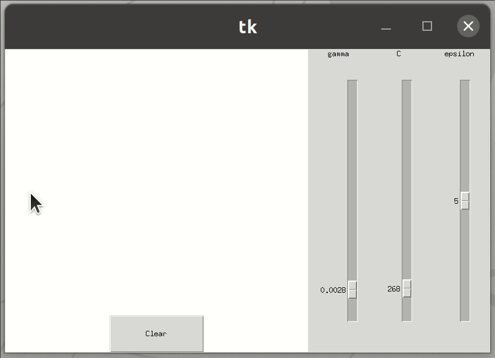

# Support vector regression visualizer

A simple app that lets you visualise support vector regression (with variable parameters) on a 2D plane.
GUI made with Tkinter. SVM model made using LIBSVM[1].

[1]  Chih-Chung Chang and Chih-Jen Lin, LIBSVM : a library for support vector machines. ACM Transactions on Intelligent Systems and Technology, 2:27:1--27:27, 2011. Software available at http://www.csie.ntu.edu.tw/~cjlin/libsvm

<p align="center">

<p align="center">

### Installing

Clone the repo
```
git clone https://github.com/jakbra/svr-visualizer
```
  
Go to folder
```
cd svr-visualizer
```

Install the dependencies
```
pip install -r requirements.txt
```
  
Run the app
```
python svr.py
```


## Acknowledgments

LIBSVM repo
* [libsvm](https://github.com/cjlin1/libsvm)
